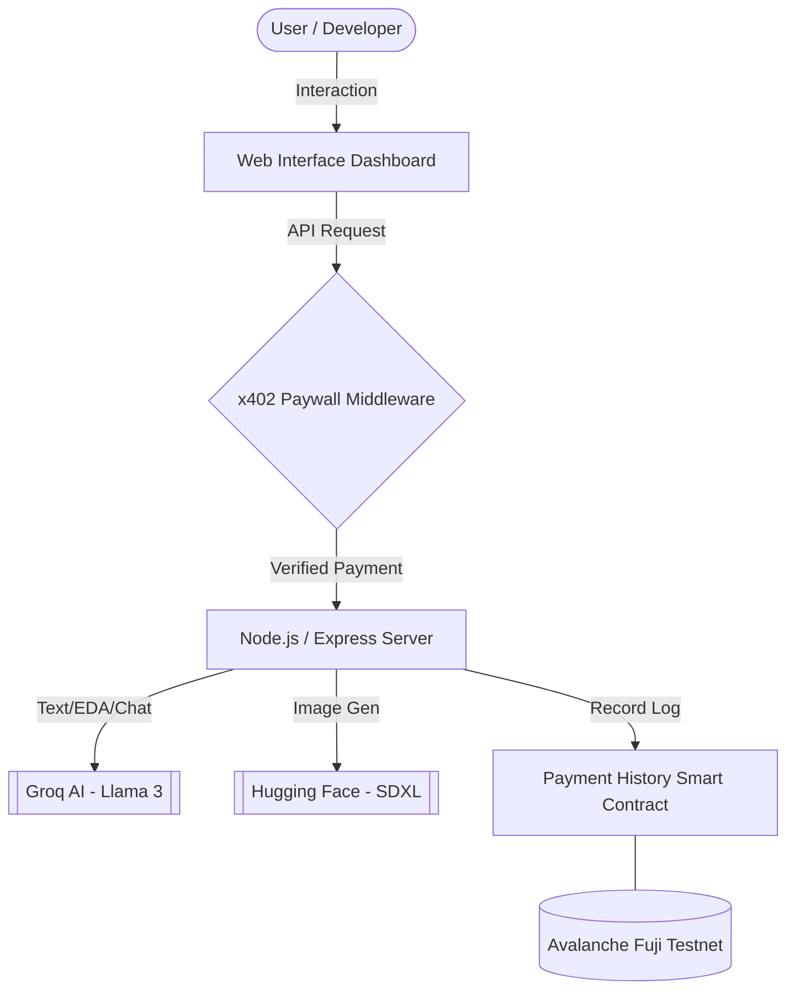

# ⚡ NeuralPay Gateway

**NeuralPay Gateway** is a multi-feature AI powerhouse that bridges modern AI models (Groq, Hugging Face) with the **x402 Payment Protocol**. It enables developers to monetize AI services through micro-fees, while ensuring **On-Chain Access Logging** on the Avalanche Fuji Testnet for transparency.

## 🏗️ System Architecture



## 🚀 Key Features

### 1. 📝 AI Text Generation & Summary
- **Summarize**: Condense long documents into concise summaries ($0.001)
- **Generate**: High-speed text generation using Groq's Llama-3-70B model ($0.002)

### 2. 🎨 AI Image Generation
- **SDXL-Lightning**: Generate high-quality 1024x1024 images from text prompts using Hugging Face's serverless inference ($0.003)

### 3. 📊 EDA Analysis (Exploratory Data Analysis)
- **Interactive Charts**: Upload CSV files for automated statistical analysis.
- **Visualizations**: Histograms, Doughnut charts, and Correlation Heatmaps using Chart.js ($0.002)

### 4. 💬 Dataset Chat
- **Talk to your Data**: Ask natural language questions about your CSV datasets.
- **Context-Aware**: AI analyzes data stats and sample rows to provide accurate insights ($0.002)

### 5. 🔍 Sentiment Analysis
- **Advanced Insights**: Deep text analysis for sentiment and keyword extraction ($0.001)

## 🛠️ Tech Stack
- **Backend**: Node.js, Express
- **AI Models**: Groq (Llama-3-70B), Hugging Face (Stable Diffusion XL)
- **Frontend**: Vanilla HTML5/CSS3 (Modern Dark Theme), Chart.js
- **Blockchain**: Solidity (Hardhat), Ethers.js
- **Payments**: Facinet SDK (x402 Protocol)
- **Network**: Avalanche Fuji Testnet

## ⚙️ Setup & Installation

1. **Clone the Repository**
   ```bash
   git clone https://github.com/sohansarkar07/MMM
   cd neuralpay-gateway
   ```

2. **Install Dependencies**
   ```bash
   npm install
   ```

3. **Configure Environment Variables**
   Create a `.env` file in the root directory:
   ```env
   GROQ_API_KEY=your_groq_key
   HF_TOKEN=your_huggingface_token
   WALLET_ADDRESS=your_avax_wallet
   PRIVATE_KEY=your_private_key
   CONTRACT_ADDRESS=your_deployed_contract
   DEMO_MODE=true
   ```

4. **Smart Contract Deployment**
   ```bash
   cd contracts
   npx hardhat run scripts/deploy.js --network fuji
   ```

5. **Run the Application**
   ```bash
   node server.js
   ```
   Access at `http://localhost:3000`

## 🔗 Blockchain Logging
Every successful AI request is logged on-chain. This ensures a transparent, immutable record of service usage and payments.
- **Contract**: [View on Snowtrace](https://testnet.snowtrace.io/address/[CONTRACT_ADDRESS])

---
*Built for the VIBATHON Hackathon.*
