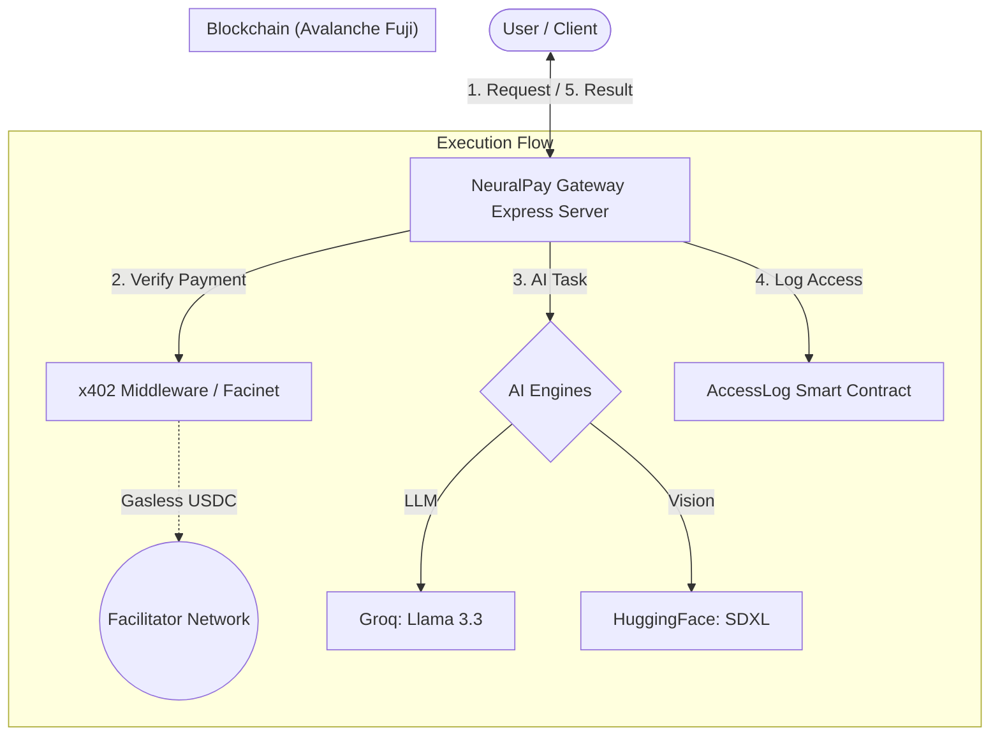
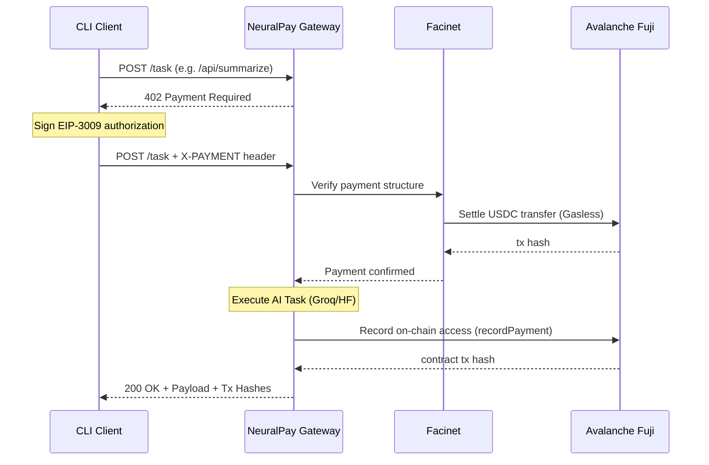
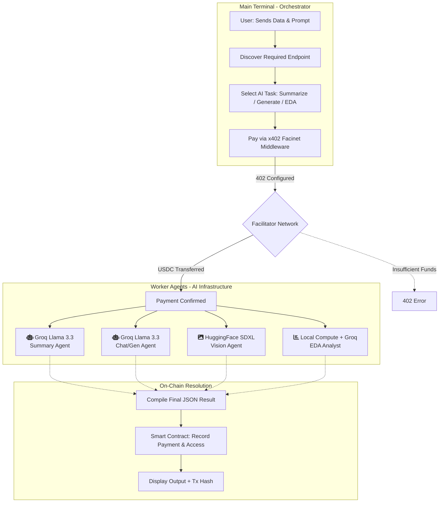

<div align="center">
  <h1>NeuralPay Gateway</h1>
  <p><b>Agent-to-Agent Payment Gateway on Avalanche</b></p>
  
  
  
  
  

  <br />
  <br />

  <h3>🎥 Demo Video</h3>
  <a href="#"></a>
  <br />
  <p><i>NeuralPay Gateway allows AI agents to hire, monetize, and pay other services in USDC via x402 protocol on Avalanche.</i></p>

  <p>
    <a href="#-proof-of-payment">Live Transaction</a> •
    <a href="#%EF%B8%8F-architecture">Architecture</a> •
    <a href="#%EF%B8%8F-task-pipeline">Pipeline</a> •
    <a href="#-setup--api-usage">Quick Start</a>
  </p>
</div>

---

## 📖 What is this?

**NeuralPay Gateway** is a pay-per-use AI infrastructure built for the autonomous economy. It allows developers to monetize AI endpoints instantly with micro-fees. Every request is gated by an **x402 paywall**, ensuring blockchain-verified settlement before any computation begins.

Give it a task like *"Analyze this dataset for growth trends"* — it automatically:

1. **Gates the request** via an HTTP 402 Paywall.
2. **Verifies ownership** of the signed USDC payment via Facinet.
3. **Executes specialized tasks** via Groq (Llama 3.3) or Hugging Face (SDXL).
4. **Logs the access** on-chain via the **AccessLog** smart contract.
5. **Returns high-speed results** once the cross-chain settlement is confirmed.

---

## ✅ Proof of Payment

| Real transaction on Avalanche Fuji Testnet |
| --- |

| Field | Value |
| --- | --- |
| **Transaction Hash** | `0x731c756ef3cd000973d9b028dac668a50e3fa90ebf6afe36e6ece4fa16ce5209` |
| **Amount** | `0.001 USDC` |
| **Status** | ✅ Success |
| **Network** | Avalanche Fuji (Testnet) |

🔗 [View on Snowscan](https://testnet.snowtrace.io/address/0x731c756ef3cd000973d9b028dac668a50e3fa90ebf6afe36e6ece4fa16ce5209)

---

## 🏗️ Architecture

### High-Level Flow



### x402 Payment Sequence



---

## ⚙️ Task Pipeline

This detailed execution pipeline mimics the complex orchestration required to handle dynamic AI endpoint requests, x402 payment confirmations, and on-chain logging seamlessly.



---

## 📁 Project Structure

```text
neuralpay-gateway/
├── server.js              # Express + Facinet paywall & Provider routes
├── demo.js                # CLI interaction demo script
├── contracts/             # Smart Contracts workspace
│   ├── contracts/
│   │   └── AccessLog.sol  # On-chain access logging contract
│   ├── scripts/
│   │   └── deploy.js      # Hardhat deployment script
│   └── hardhat.config.js  # Fuji testnet configuration
├── public/                # Glassmorphic Dashboard
│   ├── index.html         # Main UI
│   └── eda.html           # Advanced Data Analytics UI
└── .env                   # API Keys & Contract addresses
```

---

## 🧬 Smart Contracts

**Deployed on Avalanche Fuji Testnet**

| Contract | Address |
| --- | --- |
| **AccessLog** | `[CONTRACT_ADDRESS]` |
| **Reputation System** | `0x8004B663056A597Dffe9eCcc1965A193B7388713` |

---

## 🔧 Tech Stack

| Component | Technology |
| --- | --- |
| **Runtime** | Node.js 18+ |
| **Language** | TypeScript / JavaScript |
| **Blockchain** | Avalanche Fuji |
| **Payments** | x402 Protocol (Facinet SDK) |
| **LLM** | Groq (Llama 3.3-70b-versatile) |
| **Vision** | Hugging Face (SDXL Base 1.0) |
| **Chain Reads** | ethers.js / viem |
| **Discovery** | ERC-8004 Standard |

---

## 🔑 Why Facinet SDK?

| The secret sauce for seamless x402 payments |
| --- |

### The Problem
Building x402-compatible agents typically requires:
- Custom 402 response handling
- Manual payment verification
- Complex settlement logic
- Direct blockchain interactions

### Why We Chose Facinet

| Feature | Without Facinet | With Facinet |
| --- | --- | --- |
| 402 Response | Manual implementation | ✅ Automatic |
| Payment Verification | Custom API calls | ✅ Built-in middleware |
| Settlement | Direct chain interaction | ✅ Gasless via API |
| Network Support | Manual configuration | ✅ `avalanche-fuji` ready |
| Code Required | ~200 lines | ~5 lines |

### Facinet Features We Use

- **`paywall()` middleware** — Returns 402 when no payment, auto-verifies on retry
- **`/api/x402/verify`** — Validates payment signatures
- **`/api/x402/settle`** — Executes USDC transfer on-chain
- **Gasless transactions** — No AVAX needed for settlement

📚 [Facinet Documentation](https://facinet.vercel.app/docs#sdk-reference)

---

## 📊 Example Output

```text
--- Sending Request to AI Endpoint ---
POST /api/summarize

--- 402 Payment Required ---
Payment prompt received from Facinet SDK.

--- Executing Task ---
[AI] Payment verified ($0.001 USDC).
[Groq] Summarizing text via Llama 3.3...
Result: "NeuralPay Gateway seamlessly integrates crypto micro-payments..."

--- On-Chain Logging ---
Contract Record: 0x731c756ef3cd000973d9b028dac668a50e3fa90ebf6afe36e6ece4fa16ce5209
Status: PERSISTED ON AVALANCHE FUJI
```

---

## 🚀 Setup & API Usage

### 1. Clone Repo
```bash
git clone https://github.com/sohansarkar07/MMM
cd neuralpay-gateway
```

### 2. Install Dependencies
```bash
npm install
cd contracts && npm install
```

### 3. Configure Environment
Copy `.env.example` to `.env` and fill in `GROQ_API_KEY`, `HF_TOKEN`, `WALLET_ADDRESS`, and `PRIVATE_KEY`.

### 4. Deploy Smart Contract
```bash
cd contracts
npx hardhat run scripts/deploy.js --network fuji
```
- Copy the deployed address into your `.env` file as `CONTRACT_ADDRESS`.

### 5. Start Server
```bash
node server.js
```

### 6. Run Demo
```bash
node demo.js
```

---

## 🔌 API Endpoints

| Endpoint | Method | Cost | Description |
| --- | --- | --- | --- |
| `/api/summarize` | `POST` | $0.001 | Concisely summarize long text |
| `/api/generate` | `POST` | $0.002 | Creative text generation (Groq) |
| `/api/generate-image` | `POST` | $0.003 | Image generation (SDXL) |
| `/api/eda` | `POST` | $0.002 | Automated Exploratory Data Analysis |
| `/api/dataset-chat` | `POST` | $0.002 | Chat with CSV data via Llama 3.3 |
| `/api/analyze` | `POST` | $0.001 | Sentiment & Keyword extraction |

---

## 📚 References

- [x402 Protocol](https://x402.org/) — HTTP 402 payment standard
- [ERC-8004](https://eips.ethereum.org/EIPS/eip-8004) — Agent identity & reputation
- [Groq API](https://groq.com/) — High-speed LLM inference
- [Hugging Face](https://huggingface.co/) — Open-source model hub
- [Avalanche Fuji](https://docs.avax.network/) — Testnet documentation

---

## 📄 License

MIT

<br />
<div align="center">
  <b>Built with ❤️ on Avalanche</b>
</div>
