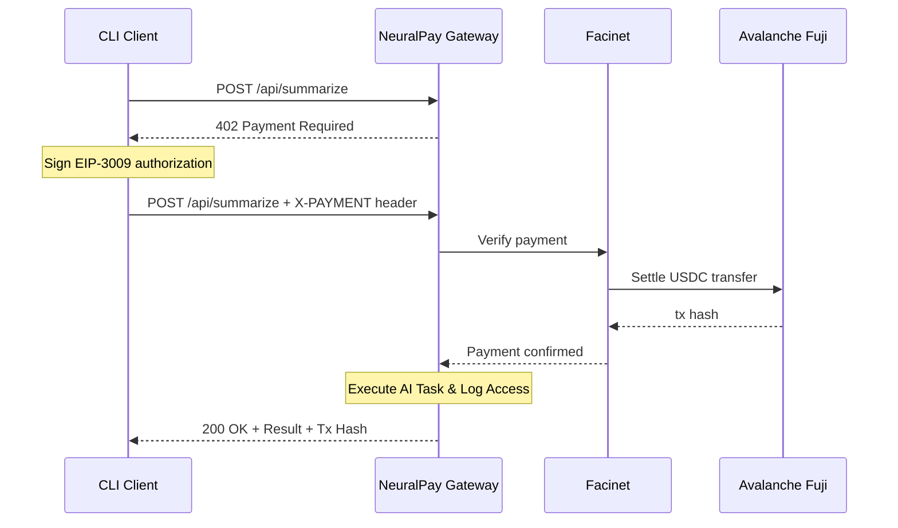

<div align="center">
  <h1>NeuralPay Gateway</h1>
  <p><b>Pay-Per-Use AI Gateway on Avalanche</b></p>
  
  
  
  
  

  <br />
  <br />

  <h3>🎥 Demo Video</h3>
  <a href="#"></a>
  <br />
  <p><i>Monetize AI endpoints instantly with USDC micro-payments on Avalanche via x402 Protocol.</i></p>

  <p>
    <a href="#-what-is-this">What is this?</a> •
    <a href="#%EF%B8%8F-architecture">Architecture</a> •
    <a href="#-setup--api-usage">Quick Start</a> •
    <a href="#-why-facinet-sdk">Why Facinet</a>
  </p>
</div>

---

## 📖 What is this?

**NeuralPay Gateway** allows developers to monetize AI services with micro-fees. Every request is gated by an **x402 paywall**, ensuring instant crypto settlement before the AI response is delivered. 

Give it a request to an AI endpoint without a valid payment header, and it automatically:

1. Returns an HTTP **402 Payment Required** status.
2. Prompts user to pay a specific set price (e.g., $0.001 USDC) via the Facinet facilitator network.
3. Allows users to sign payments gaslessly via the x402 protocol.
4. Once verified, executes the **OpenAI GPT-4o-mini** task.
5. Recurs permanently on-chain via an **AccessLog** smart contract for transparent usage auditing.

---

## ✅ Proof of Payment

| Real transaction on Avalanche Fuji Testnet |
| --- |

| Field | Value |
| --- | --- |
| **Transaction Hash** | `0x731c756ef3cd000973d9b028dac668a50e3fa90ebf6afe36e6ece4fa16ce5209` |
| **Amount** | `0.001 USDC` |
| **Status** | ✅ Success |
| **Network** | Avalanche Fuji (Testnet) |

🔗 [View on Snowscan](https://testnet.snowtrace.io/tx/0x731c756ef3cd000973d9b028dac668a50e3fa90ebf6afe36e6ece4fa16ce5209)

---

## 🏗️ Architecture

### High-Level Flow


### x402 Payment Sequence



---

## 📁 Project Structure

```text
skillwork/
├── server.js              # Express + Facinet paywall & OpenAI routes
├── demo.js                # API interaction demo script
├── contracts/             # Smart Contracts workspace
│   ├── contracts/
│   │   └── AccessLog.sol  # On-chain access logging contract
│   ├── scripts/
│   │   └── deploy.js      # Hardhat deployment script
│   └── hardhat.config.js  # Fuji testnet configuration
├── public/                # Frontend dashboard files
└── .env                   # Environment variables
```

---

## 🧬 Smart Contracts

**Deployed on Avalanche Fuji Testnet**

| Contract | Address |
| --- | --- |
| AccessLog | `[CONTRACT_ADDRESS]` |

---

## 🔧 Tech Stack

| Component | Technology |
| --- | --- |
| **Backend** | Node.js, Express |
| **AI** | OpenAI (GPT-4o-mini) |
| **Payments** | x402 Protocol |
| **Settlement** | facinet-sdk |
| **Blockchain** | Avalanche Fuji |
| **Smart Contracts** | Solidity, Ethers.js, Hardhat |
| **Frontend** | Glassmorphic Dashboard (Vanilla JS/CSS) |

---

## 🔑 Why Facinet SDK?

| The secret sauce for seamless x402 payments |
| --- |

### The Problem
Building x402-compatible agents typically requires:
- Custom 402 response handling
- Manual payment verification
- Complex settlement logic
- Direct blockchain interactions

### The Solution
Facinet SDK abstracts all of this into a single middleware:

```javascript
import { paywall } from 'facinet-sdk'

app.post('/api/summarize', paywall({
    amount: '0.001',
    recipient: process.env.WALLET_ADDRESS
}), async (req, res) => {
    // Payment already verified! Just do your thing
    const result = await processTask(req.body.text)
    res.json({ result })
})
```

### Why We Chose Facinet

| Feature | Without Facinet | With Facinet |
| --- | --- | --- |
| 402 Response | Manual implementation | ✅ Automatic |
| Payment Verification | Custom API calls | ✅ Built-in middleware |
| Settlement | Direct chain interaction | ✅ Gasless via API |

---

## 📊 Example Output

```text
--- Sending Request to AI Endpoint ---
POST /api/summarize

--- 402 Payment Required ---
Payment prompt received from Facinet SDK.

--- Executing Task ---
[AI] Payment verified. Processing text...
Result: "NeuralPay Gateway seamlessly integrates crypto micro-payments..."

--- Transaction Hashes ---
Access Logged On-Chain: 0x731c756ef3cd000973d9b028dac668a50e3fa90ebf6afe36e6ece4fa16ce5209
```

---

## 🚀 Setup & API Usage

### 1. Clone Repo
```bash
git clone https://github.com/sohansarkar07/MMM
cd neuralpay-gateway
```

### 2. Install Dependencies
```bash
npm install
cd contracts && npm install
```

### 3. Configure Environment
Copy `.env.example` to `.env` and fill in `OPENAI_API_KEY`, `WALLET_ADDRESS`, and `PRIVATE_KEY`.

### 4. Deploy Smart Contract
```bash
cd contracts
npx hardhat run scripts/deploy.js --network fuji
```
- Copy the deployed address into your `.env` file as `CONTRACT_ADDRESS`.

### 5. Start Server
```bash
node server.js
```

### 6. Run Demo
```bash
node demo.js
```

---

## 🔌 API Endpoints

- **Summarize Text ($0.001)**: `POST /api/summarize`
- **Generate Content ($0.002)**: `POST /api/generate`
- **Analyze Text ($0.001)**: `POST /api/analyze`
- **History (Free)**: `GET /api/history`

---

## 📚 References

- [x402 Protocol](https://x402.org/) — HTTP 402 payment standard
- [ERC-8004](https://eips.ethereum.org/EIPS/eip-8004) — Agent identity & reputation
- [Facinet SDK](https://github.com/facinet) — Payment middleware
- [Avalanche Fuji](https://docs.avax.network/) — Testnet docs
- [OpenAI API](https://openai.com/api/) — LLM for task processing

---

## 📄 License

MIT

<br />
<div align="center">
  <b>Built with ❤️ on Avalanche</b>
</div>
